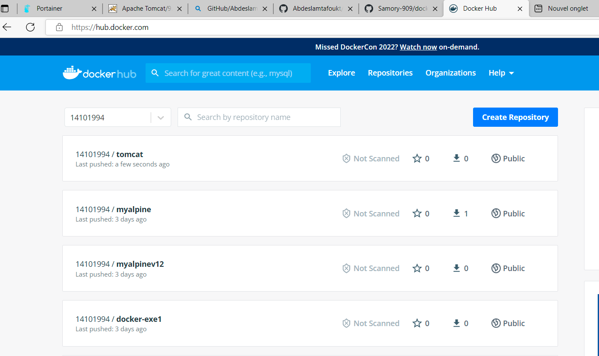

# docker-exe2

Exercice 2

## le contenu du fichier Dockerfile:
"FROM fabric8/tomcat-9

LABEL maintainer=”dyhiaaouabed@gmail.com”

ADD webapp.war /opt/tomcat/webapps/
"

## Builder l'image tomcat à partir du docker file
docker build -t tomcat:v1    .

## le port utilisé
docker inspect tomcat:v1

## Lancer le conteneur TOM en deamon
docker run -d -p 8080:20200 --name DyhiaContainer tomcat:v1

## la page d'acceuil Tomcat:

echo "If you're seeing this, you've successfully installed Tomcat. Congratulations!" > result.txt

## création d'un user tomcat dans le conteneur:
cd /opt/tomcat/conf/
"vi tomcat-users.xml"
"<user name="logwire" password="docker" roles="admin-gui,admin-script,manager-gui,manager-status,manager-script,manager-jmx"/>"

## Charger ll'image crée dans le compte Docker-hub

docker login
docker image tag tomcat:v1 14101994/tomcat:v1
docker push 14101994/tomcat:v1

## Pusher les fichier sur Origin main
git add .
git commit -m"EXERCICE2"
git push origin main 
## FIN D'EXERCICE
